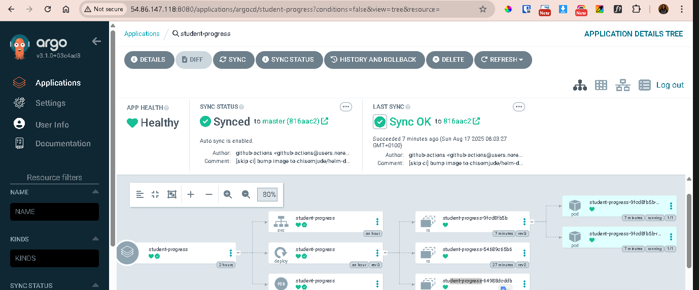

# GITOPS  - with Git Actions and Argo-cd
his guide sets up a Kind Kubernetes cluster on an EC2 instance, installs Argo CD, wires your Helm chart & CI, and uses port‑forwarding (not LoadBalancer) to access both the Argo CD UI (8080) and the app (8000).

## Set up your environment
On a new EC2 instance, run these installations (skip if already set up). Ensure all the ports you intend to use are enabled on your security group - 80,8080,8000 etc

```
# Update base
sudo apt-get update -y

# Install Docker
sudo apt-get install -y ca-certificates curl gnupg lsb-release
sudo install -m 0755 -d /etc/apt/keyrings
curl -fsSL https://download.docker.com/linux/ubuntu/gpg | sudo gpg --dearmor -o /etc/apt/keyrings/docker.gpg
echo \
  "deb [arch=$(dpkg --print-architecture) signed-by=/etc/apt/keyrings/docker.gpg] \
  https://download.docker.com/linux/ubuntu $(lsb_release -cs) stable" \
  | sudo tee /etc/apt/sources.list.d/docker.list > /dev/null
sudo apt-get update -y
sudo apt-get install -y docker-ce docker-ce-cli containerd.io
sudo usermod -aG docker $USER
newgrp docker

# Install kubectl
curl -LO "https://dl.k8s.io/release/$(curl -L -s https://dl.k8s.io/release/stable.txt)/bin/linux/amd64/kubectl"
chmod +x kubectl && sudo mv kubectl /usr/local/bin/

# Install kind
curl -Lo ./kind https://kind.sigs.k8s.io/dl/v0.23.0/kind-linux-amd64
chmod +x kind && sudo mv kind /usr/local/bin/

# Install Helm
curl https://raw.githubusercontent.com/helm/helm/main/scripts/get-helm-3 | bash


```

## Create your kind cluster 

```
cat <<EOF > kind-config.yaml
kind: Cluster
apiVersion: kind.x-k8s.io/v1alpha4
nodes:
- role: control-plane
  kubeadmConfigPatches:
  - |
    kind: InitConfiguration
    nodeRegistration:
      kubeletExtraArgs:
        node-labels: "ingress-ready=true"
  extraPortMappings:
  - containerPort: 80
    hostPort: 80
  - containerPort: 443
    hostPort: 443
- role: worker
EOF

kind create cluster --config kind-config.yaml --name kind

# Confirm using kubectl get nodes

```


## Install ArgoCD
We’re not using ingress here; we’ll expose Argo CD on :8080 and the app on :8000 via port-forward, to use ingress, follow this guide here for your cluster setup - https://github.com/kubernetes-sigs/cloud-provider-kind

```
helm repo add argo https://argoproj.github.io/argo-helm
helm repo update

# Mrun server in --insecure (HTTP) because we’ll port-forward over 8080 .
cat > argo-values.yaml <<'EOF'
server:
  extraArgs:
    - --insecure
  service:
    type: ClusterIP
EOF

# install argocd
kubectl create namespace argocd 2>/dev/null || true
helm upgrade --install argo-cd argo/argo-cd -n argocd -f argo-values.yaml

# Wait for pods and confirm services 
kubectl -n argocd get pods,svc

# Initial admin password - user: admin ( you can change the generated password on the UI or Save the initial )
kubectl -n argocd get secret argocd-initial-admin-secret -o jsonpath="{.data.password}" | base64 -d; echo


# Expose the UI on all interfaces (EC2 public IP:8080) 
kubectl -n argocd port-forward svc/argo-cd-argocd-server 8080:80 --address 0.0.0.0

# or Use nohup to run in background mode
nohup kubectl -n argocd port-forward svc/argo-cd-argocd-server 8080:80 --address 0.0.0.0 > argocd-portforward.log 2>&1 &

# tail your Argocd logs on 
tail -f argocd-portforward.log

#to kill the process for argocd , get the PID and Kill
ps aux | grep 'kubectl -n argocd port-forward'
kill -9 <pid>   #eg kill -9 230745

```
#### Remember to update your initial Password in User Info 


## Application Deployment 

Let's prepare our app repo using the format in 
[Complete-app-deployment-with-gitops](https://github.com/ChisomJude/complete-app-deployment-with-gitops)

```
Feel free to reuse your application for Week 6  and helm file in week 5,  since you already have a working CI, however you will need to make adjustments.
``
├── .github/
│ └── workflows/
│ └── ci.yml  #ci to build image using gitactions
│
├── argocd/
│ └── student-progress-app.yml  #ref- run on cluster to add app to argocd
│
├── helm/
│ └── student-progress/
│ ├── templates/
│ │ ├── _helpers.tpl
│ │ ├── deployment.yaml
│ │ ├── pda.yml
│ │ ├── service.yaml
│ │ └── ingress.yaml # (if you add want to use ingress)
│ ├── Chart.yaml
│ └── values.yaml
│
├── src/
│ └── app/   # app files except requirement file and dockerfile
│ ├── init.py
│ ├── crud.py
│ ├── database.py
│ ├── main.py
│ ├── models.py
│ └── templates/
│       └──index.html
│       │__other html files (your HTML templates here)
│
├── Dockerfile
├── requirements.txt
├── LICENSE
└── README.md
```


### Add the file to Argo CD

This step adds you app to argocd. Ref - `student-progress-app.yml` run this file on your cluster  using kubectl apply -f file.yml


```
apiVersion: argoproj.io/v1alpha1
kind: Application
metadata:
  name: student-progress
  namespace: argocd  #argocd namespace
spec:
  project: default
  source:
    repoURL: https://github.com/ChisomJude/complete-app-deployment-with-gitops.git
    targetRevision: master
    path: helm/student-progress
  destination:
    server: https://kubernetes.default.svc
    namespace: my-app   #app namespace
  syncPolicy:
    automated:
      prune: true
      selfHeal: true
```

### Apply the Application

```
kubectl apply -n argocd -f argocd/student-progress-app.yaml
kubectl -n argocd get applications.argoproj.io

```
### Create Secret 
Create the app Secret once in the destination namespace, we wont be commiting secrets in git , we will reference this in helm files. 

```
kubectl -n my-app create secret generic vault-secrets \
  --from-literal=VAULT_ADDR="http://44.x.x.x:8200" \
  --from-literal=VAULT_ROLE_ID="REPLACE_ROLE_ID" \
  --from-literal=VAULT_SECRET_ID="REPLACE_SECRET_ID"

```
### GITOPS - Build, Push, Bump Chart
 Your ci is expected to build your docker image `.github/workflows/ci.yml`
 - Builds `DOCKERHUB_USER/helm-deployment-app:${GITHUB_SHA}`
 - Pushes to Docker Hub
 - Updates helm/student-progress/values.yaml with new image.repository, image.tag 
 - Argo CD auto‑syncs that commit

### Push your app  and test your deployment
Once your app is synced and Healthfrom argocd ui
Port Forward




```
nohup kubectl -n my-app port-forward svc/student-progress 8000:80 --address 0.0.0.0 > app-pf.log 2>&1 &
tail -f app-pf.log
```


